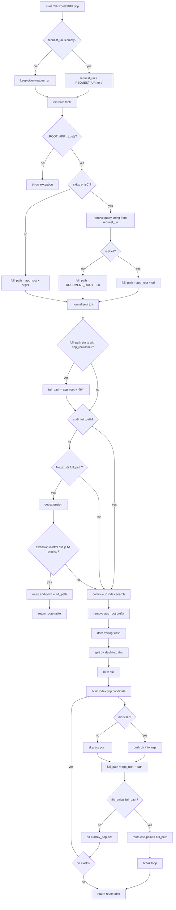

# `CalcRoute2018.php` As-Is

## Scope

This document describes the current As-Is behavior of:

- `asset/unit/router/include/CalcRoute2018.php`

This file is the actual route calculator used by the current Router unit.

## Role

`CalcRoute2018.php` receives the current request context and returns a route table.

Its output shape is:

```text
{
  "args": [],
  "end-point": "/full/path/to/endpoint"
}
```

The file does not execute the endpoint.

Its responsibility stops at calculating:

- the endpoint path
- the router arguments

## Input Source

If `$request_uri` is empty, the file starts from:

- `$_SERVER['REQUEST_URI']`

and falls back to:

- `/`

It then initializes the route table with:

- `args = []`
- `end-point = null`

## App Root Requirement

The calculation requires:

- `_ROOT_APP_`

If `_ROOT_APP_` is not available, the file throws an exception.

## Request Context Split

The current implementation splits its behavior depending on request context.

### HTTP or CI

If either of these is true:

- `OP()->isHttp()`
- `OP()->isCI()`

then the calculator treats the request as HTTP-style routing input.

It:

1. removes the query string from the request URI
2. builds a full path

Inside that branch, there is another split:

- if `OP()->isShell()` is true, use `_ROOT_APP_ . $uri`
- otherwise, use `$_SERVER['DOCUMENT_ROOT'] . $uri`

This is the current As-Is behavior that supports CI-driven HTTP testing from the shell.

### Shell

If the request is neither HTTP nor CI, the calculator uses:

- `_ROOT_APP_ . ($_SERVER['argv'][1] ?? '')`

So the shell-mode route source is the first CLI argument relative to the app root.

## Path Normalization

After building the full path, the current implementation normalizes duplicate slashes by applying:

- `str_replace('//', '/', $full_path)`

This is a simple normalization step, not a more advanced path canonicalization routine.

## `asset/` Path Restriction

If the calculated full path starts with:

- `<app_root>/asset/`

then the calculator rewrites the target to:

- `<app_root>/404`

This means direct endpoint resolution inside the application asset tree is not allowed in the normal routing path.

## Current Pass-Through Branch

The next branch checks the resolved full path.

### Directory

If `is_dir($full_path)` is true, the calculator does not return early.

It simply continues to the later `index.php` search flow.

### Existing File

If `file_exists($full_path)` is true, the calculator reads the extension and checks it against the current pass-through candidates:

- `html`
- `css`
- `js`
- `txt`
- `png`
- `ico`

If the extension matches, the file itself becomes the endpoint and the route table is returned immediately.

## Extension Check Detail

The current implementation checks pass-through support with a string search:

```php
strpos('html, css, js, txt, png, ico', $extension) !== false
```

So the current As-Is implementation uses string containment rather than a normalized extension array.

This document describes that only as current implementation detail.

## [DOC-GAP] Hard-Coded Pass-Through Extensions

The current pass-through extension list is hard-coded directly inside `CalcRoute2018.php`.

That means the current routing behavior depends on source-level editing of the route calculator rather than a configurable application policy.

This is an As-Is implementation detail, not an ideal expression of the broader framework idea.

The broader idea of HTML Pass-Through has already expanded beyond only historical HTML-oriented usage.

From that point of view, the pass-through target set should not be fixed in the calculator source itself.

## [DOC-FUTURE] Move Pass-Through Extension Control to Config

The pass-through target extensions should be separated into configuration.

That would make the routing policy:

- easier to inspect
- easier to change per application
- more consistent with the framework idea of separating behavior from hard-coded implementation decisions

So the current hard-coded extension string should be understood as a current gap between implementation and intended design direction.

## Upward `index.php` Search

If the request is not returned by the pass-through branch, the calculator searches for an `index.php` endpoint.

The current steps are:

1. remove the app root prefix from the full path
2. trim the trailing slash
3. split the remaining path by `/`
4. search for `index.php` from the deepest path upward

Example:

```text
/foo/bar/baz
```

Search order:

```text
/foo/bar/baz/index.php
/foo/bar/index.php
/foo/index.php
```

## Argument Construction

When the search moves up one level, the removed path segment is added to `args`.

The current implementation does this with:

- `array_unshift(...)`
- `OP()->Encode($dir)`

That means:

- removed path parts are preserved in original order
- each part is encoded before being stored

## Unresolved Case

If no matching `index.php` is found, the calculator returns the route table with:

- `args` as accumulated
- `end-point = null`

The current include file does not force a `404` fallback for general unresolved paths.

It simply returns the unresolved route result.

What happens next belongs to the consumer of the route table.

## Relationship to `Router.class.php`

In the current design:

- `CalcRoute2018.php` performs the route calculation
- `Router.class.php` stores and exposes the returned route table

So the include file is the routing engine, while the class is the route-state holder.

## Flowchart

### Mermaid



### ASCII

```text
Start
  |
  +-- request_uri empty?
  |     |
  |     +-- yes -> REQUEST_URI or "/"
  |     |
  |     +-- no  -> use given request_uri
  |
  +-- init route table
  |     args = []
  |     end-point = null
  |
  +-- _ROOT_APP_ exists?
  |     |
  |     +-- no  -> throw exception
  |     |
  |     +-- yes
  |
  +-- isHttp() or isCI() ?
  |     |
  |     +-- yes
  |     |     |
  |     |     +-- remove query string
  |     |     +-- isShell() ?
  |     |           |
  |     |           +-- yes -> full_path = app_root + uri
  |     |           +-- no  -> full_path = DOCUMENT_ROOT + uri
  |     |
  |     +-- no
  |           |
  |           +-- full_path = app_root + argv[1]
  |
  +-- normalize duplicate slash
  |
  +-- full_path starts with app_root/asset/ ?
  |     |
  |     +-- yes -> full_path = app_root + "404"
  |     +-- no
  |
  +-- is_dir(full_path) ?
  |     |
  |     +-- yes -> continue
  |     +-- no
  |           |
  |           +-- file_exists(full_path) ?
  |                 |
  |                 +-- no  -> continue
  |                 +-- yes
  |                       |
  |                       +-- get extension
  |                       +-- pass-through extension?
  |                             |
  |                             +-- yes -> end-point = full_path -> return
  |                             +-- no  -> continue
  |
  +-- remove app_root prefix
  +-- trim trailing slash
  +-- split path into dirs
  +-- dir = null
  |
  +-- loop
        |
        +-- build .../index.php candidate
        +-- dir is set?
        |     |
        |     +-- yes -> push Encode(dir) into args at head
        |     +-- no
        |
        +-- full_path = app_root + candidate
        +-- file_exists(full_path) ?
              |
              +-- yes -> end-point = full_path -> break -> return
              +-- no  -> dir = array_pop(dirs)
                            |
                            +-- dir exists? yes -> repeat loop
                            +-- dir exists? no  -> return unresolved route
```
